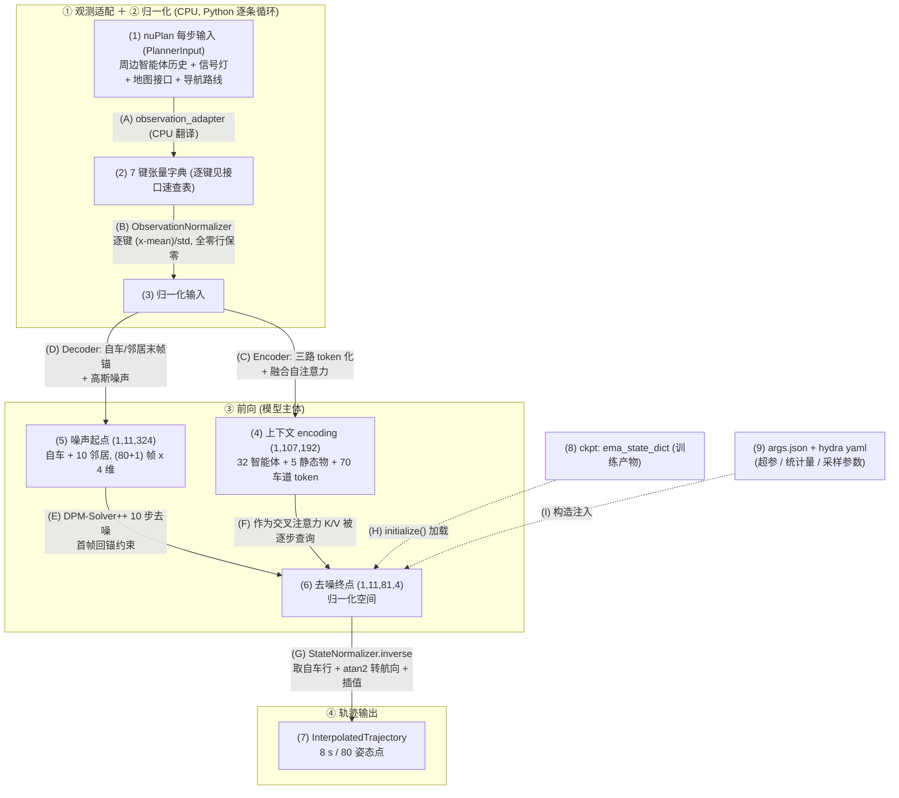
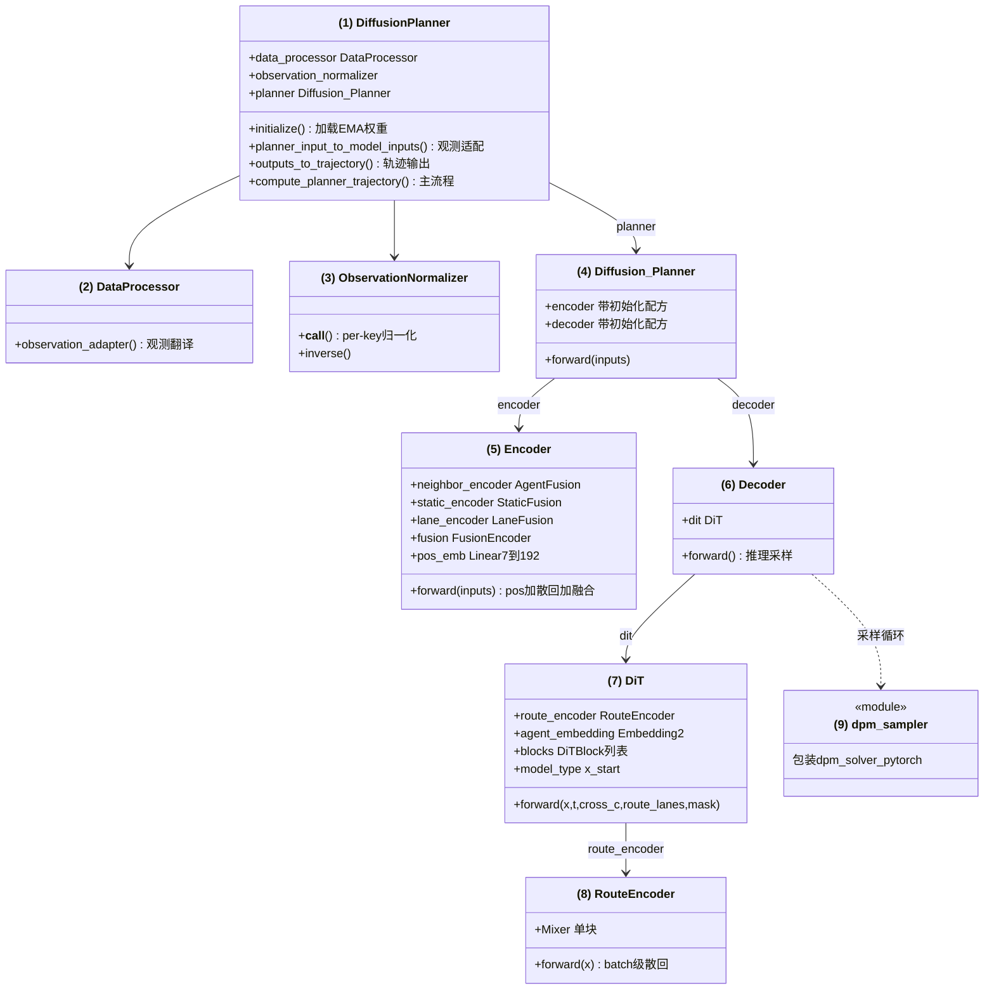
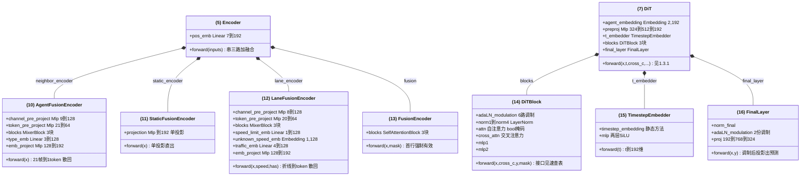
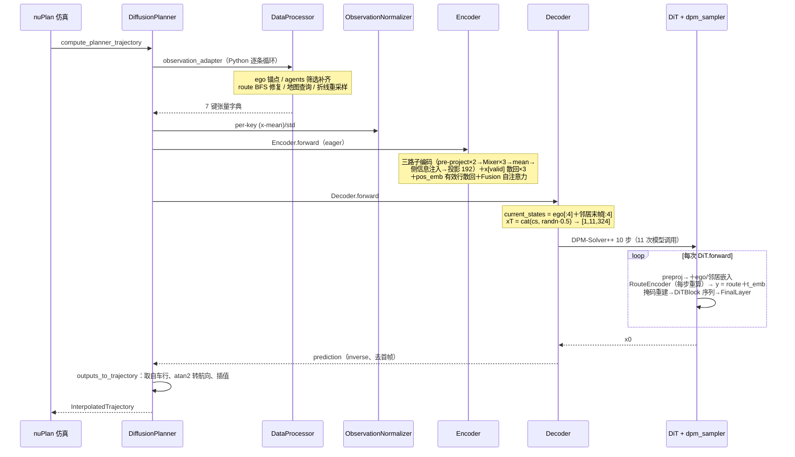
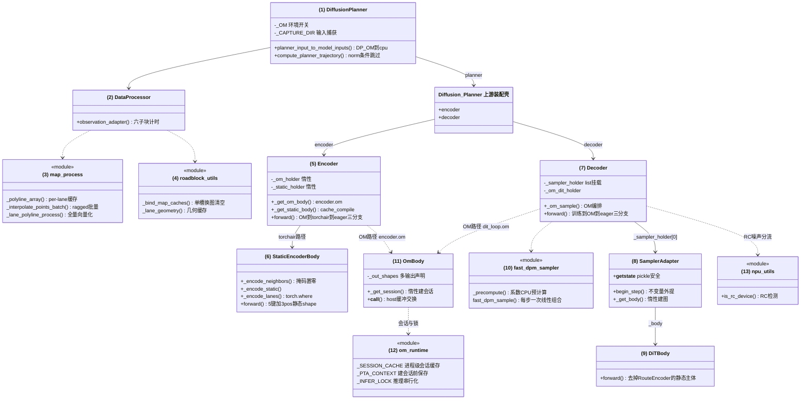
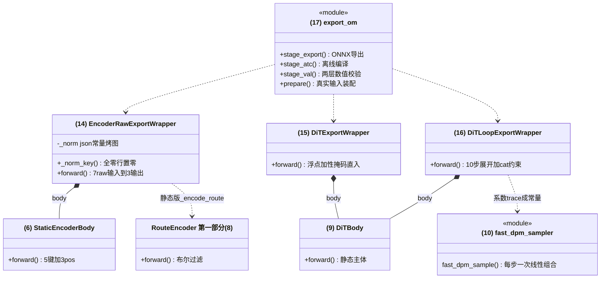
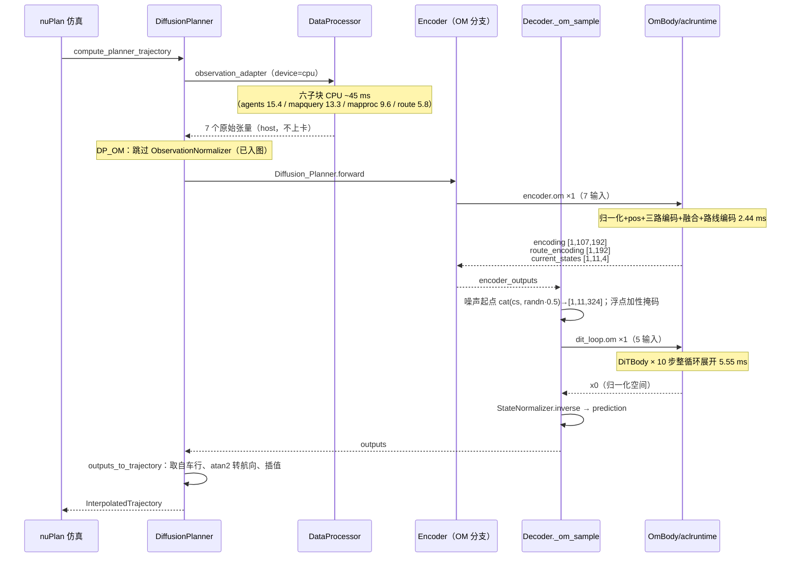
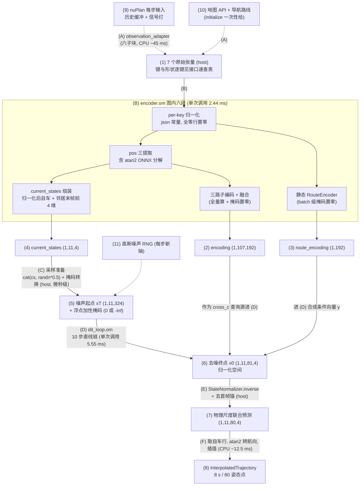
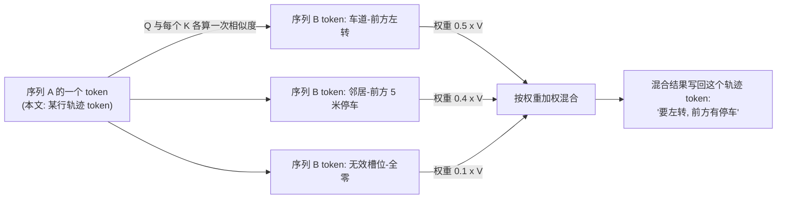

# Diffusion-Planner 昇腾 NPU 推理设计说明书

# 第一部分：原仓设计（上游）

> 上游为 GPU/CUDA 设计。本部分呈现其推理架构：推理主链与配置体系，粒度到类/模块级，张量细节只讲理解结构所必需的。类与方法清单抽自基线 commit `a3a621f0`（本仓首笔移植提交的父），git 实证。

## 1. Story（上游）

> Diffusion-Planner 是基于扩散模型的端到端自动驾驶规划器（DiT 骨干 + [DPM-Solver++](#term-dpm) 10 步采样）。它在 nuPlan [闭环仿真](#term-closed-loop)框架下运行：仿真每走一步，把当时的观测（自车与周边智能体的历史轨迹、矢量地图要素、导航路线）交给它，经扩散去噪直接输出自车未来轨迹（8 s / 80 个姿态点 @10 Hz，每点 x/y/cos/sin），并联合预测 10 个邻居的未来轨迹。

## 2. 全景：推理四阶段数据流

`compute_planner_trajectory` 按四个阶段顺序执行，这四个阶段也是全文的骨架——§3.2 时序图、第二部分的时序/流程说明/数据流图沿用同一划分，只是第二部分的前向阶段换成了编译图。图上：框＝阶段（①观测适配＋②归一化 / ③前向 / ④轨迹输出），节点标 `(1)`–`(9)`、变换边标 `(A)`–`(I)`，逐条解释见下图下：

**图 1.2.1：上游推理四阶段数据流**（虚线 = 外部输入，进程初始化时注入一次，不随每步变化）

按数据流顺序逐条解释。读法约定：**数字编号＝数据形态（站），字母编号＝变换（走的路）**——字母边抵达的下一个数字节点就是该变换的结果，例如 (3) 是 (B) 的结果（(2) 被 (B) 缩放后的形态），不是继 (B) 之后的又一步。末尾四条是启动时注入的外部输入，不在流程内：

- **(1) nuPlan 每步输入**：闭环仿真一小步一小步地推进，每步仿真器把当时能看到的世界打包成一个 `PlannerInput`、调 [`compute_planner_trajectory(PlannerInput) → 轨迹`](#iface-entry) 送进来换一条轨迹——(1) 指的就是这份每步送进来的输入。里面规划器能用的就四样东西——两样每步新交（**周边谁在动、怎么动的**：[历史缓冲](#iface-history)里每个车/行人/骑行者过去 2 s 逐帧的位置、速度、朝向，21 帧，[TrackedObjects](#term-tracked) 感知对象，没有"他想干什么"的信号，别的车接下来会怎么开只能从这段历史里猜；**红绿灯**：[信号灯状态列表](#iface-traffic)，当前相位），两样 `initialize` 一次性拿到、每步复用（**路**：[地图接口](#iface-map)按半径查附近的车道中心线与边界，要多少查多少，不是整张地图；**去哪**：[导航路线](#iface-route)，一串路段 id，只指方向不指开法）。另有一样在手里却不进模型：自车自己的历史轨迹（推理只取自车当前位置作参考原点）。这四样定了后面两件事的基调——形状恒定（第二部分图编译的前提）、每步的查询和翻译全在 CPU 上做（观测适配段的工作量所在）

- **(A) observation_adapter（六件事按序，承担类 (2)）**：取自车后轴位姿作坐标锚（后续所有实体的世界坐标都转成相对它的——模型学的是自车视角下的相对位置）；`agent_past_process` 按类型配额筛智能体（车辆/行人骑行者分上限）、对齐排序、补零到 32 槽（输入端 `sampled_tracked_objects_to_array_list` 从 devkit [TrackedObjects](#term-tracked) 逐对象逐字段抽数组）；`route_roadblock_correction` BFS 修复断连路线；`get_neighbor_vector_set_map` 按半径查车道/边界/路线要素；`map_process` 折线定长重采样（20 点）、拼 12 维特征；`convert_to_model_inputs` 转 torch 张量。上游全 Python 逐条循环，①②合计无可学习参数——第二部分数据管线优化的主战场

- **(2) 7 键张量字典**：翻译 (A) 的产物，共 7 键——[neighbor_agents_past](#iface-in-agents)（会动的）、[static_objects](#iface-in-static)（不动的）、[lanes](#iface-in-lanes)（车道）、[lanes_speed_limit](#iface-in-speed)、[lanes_has_speed_limit](#iface-in-hasspeed)、[route_lanes](#iface-in-route)（路线）、[ego_current_state](#iface-in-ego)（自车锚）；形状/维数/来源逐键见文末**接口速查表**。无效槽位补零占位，有效性由"整行全零"就地判出——该约定贯穿全仓（编码器散回、DiT 掩码、第二部分掩码置零都建立在它上）

- **(B) ObservationNormalizer（逐键缩放）**：7 键各按训练 json 的 mean/std 做 `(x-mean)/std`；json 里没有的键原样透传；全零行缩放后仍精确为零（无效行语义不破坏）。统计量是训练常量——第二部分把它整个烤进编译图

- **(3) 归一化输入**：网络的数值"手感"是训练喂出来的——训练全程吃的都是缩放后的统一范围，超出范围的数它没见过、也答不准。而输入键里混着量纲悬殊的数：坐标几十上百米、速度个位数米每秒、朝向是一对 cos/sin（航向角转成余弦/正弦表示，取值 ±1——避开角度在 ±180° 跳变处的数值突变），都远在训练范围之外。所以这一步用与训练同一套公式——减均值、除以标准差——把每个数变成"离均值几个标准差"，让网络看到的数值分布与训练时一致，预测才不跑偏（mean/std 是训练集算好的统计量，随权重发布）。键与形状都不变，变的只是数值（具体规则见 (B)）

- **(C) Encoder（观测侧一路）**：前向从 (3) 分成并行的两路，这一路管观测——三路子编码器（智能体/静态物/车道）把异构观测各编码成 token，拼成 107 个后过融合自注意力

- **(D) Decoder 构造起点（轨迹侧一路）**：并行两路的另一路管轨迹——自车与邻居的末帧状态拼成锚点、与高斯噪声拼成[噪声起点](#term-x0)（扩散链的噪声端；记号与生成原理见术语表）

- **(4) 上下文 encoding**：(1,107,192)＝32 智能体 + 5 静态物 + 70 车道各压成 1 个 **[token](#term-token)**（＝一个实体或要素压成的一个 192 维向量，借用 NLP"词元"概念）拼成的序列

- **(5) 噪声起点**：(1,11,324)＝自车 + 10 邻居共 11 行 × (80+1) 帧 × 4 维；每行首帧是当前状态锚、其余为高斯噪声

- **(E) DPM-Solver++ 10 步去噪（轨迹侧推进）**：从随机走向合理的 10 步迭代——推理时手里没有真轨迹，每步模型给出"噪声里的干净轨迹长什么样"的判断、据此剥一层噪声（[生成原理与记号](#term-x0)见术语表）。每次模型调用内部过 3 个 DiTBlock，每块前半是**自注意力**（11 行轨迹 token 互相看、拉齐各行节奏），后半是交叉注意力（即 (F)）；步间回锚约束把已知的首帧钉回当前状态，防迭代漂移（共 11 次模型调用，含末端去余噪）。终点＝去噪终点（归一化空间的联合轨迹预测）

- **(F) 上下文注入（[交叉注意力](#term-crossattn)）**：上下文 token 作为被查方（K/V）被每个去噪步的轨迹 token 查询——这是观测影响规划的唯一通路，也是两路在此汇合的地方

- **(6) 去噪终点**：(1,11,81,4)——11 行 × (80 未来 + 1 锚) 帧 × 4 维，归一化空间的联合轨迹预测

- **(G) 轨迹输出**：`StateNormalizer.inverse` 反归一化回物理尺度、去首帧锚、取自车行（11 行联合预测闭环只用 1 行，邻居行服务训练监督）、`atan2(sin, cos)` 转航向、插值成轨迹对象

- **(7) InterpolatedTrajectory**：8 s / 80 姿态点的 nuPlan 轨迹对象，交回仿真器执行

- **(8) ckpt: ema_state_dict**（外部输入）：训练产物的 **[EMA](#term-ema)** 版权重（训练期对权重做指数移动平均所得，通常比最终权重更稳）

- **(9) args.json + hydra yaml**（外部输入）：模型结构超参、归一化统计量、采样参数（hydra 负责按声明实例化 planner）

- **(H) initialize() 加载**（外部输入）：进程启动时把权重加载进模型壳（Encoder/Decoder），只执行一次

- **(I) 构造注入**（外部输入）：`Config` 读入 args.json 并展平成属性、随构造传入各模块，同样只在初始化发生——(8)/(9) 都不参与每步数据流

下钻指引：持有关系与逐类速览见 §3.1（图 1.3.1/1.3.2），输入各键维数见接口速查表，调用顺序与每步内部见 §3.2（图 1.3.3）。

## 3. 推理链

§2 已按数据流把一次规划步走了一遍；本节换结构视角讲同一件事：先看类之间的持有与调用关系与逐类速览（3.1），再看调用按什么顺序发生（3.2）；模型吃什么（7 键）已在 §2 与接口速查表给出。持有关系一句话概括：**DiffusionPlanner 是 nuPlan 适配器**，持有观测适配器、归一化器与模型壳；**模型壳装配 Encoder 与 Decoder**；**Decoder 持有 DiT，DiT 又内嵌 RouteEncoder**——导航编码器长在去噪网络身体里，这个嵌套正是第二部分"循环不变量外提"要拆开的点。

### 3.1 类图

**图 1.3.1：上游调用结构**（方法清单抽自基线 `a3a621f0`；实线 = 持有，虚线 = 工具性调用；框内数字＝类编号，逐类速览见下图下）

逐类职责与图 1.2.1 流程图的对应（本图框号不带前缀；带 `§2` 前缀的编号指流程图的数据节点与变换）：

- **(1) DiffusionPlanner**：nuPlan 适配器——§2 (1) 的入口调用落在它的 `compute_planner_trajectory()`，§2 (H) 的权重加载落在 `initialize()`（优先取 EMA 权重、剥离 DDP 的 `module.` 前缀）；四步主流程的编排者（另两步的方法：`planner_input_to_model_inputs()` 与 `outputs_to_trajectory()`）；历史/未来采样参数由 yaml 给定——20 姿态 / 2 s、80 姿态 / 8 s

- **(2) DataProcessor**：变换 §2 (A) 的实现者是它的 `observation_adapter()`，产出 §2 (2) 的 7 键张量字典

- **(3) ObservationNormalizer**：变换 §2 (B) 落在它的 `__call__()`（把它当函数调用），产出 §2 (3) 归一化输入

- **(4) Diffusion_Planner**：模型壳——`__init__` 装配 (5)(6) 并打权重初始化配方，`forward()` 原样转发：先 `encoder(inputs)` 再 `decoder(...)`

- **(5) Encoder**：变换 §2 (C) 落在它的 `forward()`（内部依次调三路子编码器 (10)(11)(12) 与融合层 (13)），产出 §2 (4) 上下文 encoding

- **(6) Decoder**：`forward()` 的推理分支即 §2 (D)（构造噪声起点）与 §2 (G)（轨迹输出收尾），采样循环本身委托给 (9)、步间回锚靠 `initial_state_constraint`（把每行首帧强制写回 current_states）

- **(7) DiT**：变换 §2 (E)(F) 的真正执行者——11 次模型调用的每一次就是一次 `DiT.forward()`（零件 (14)–(16) 见图 1.3.2）；`agent_embedding` 行 0＝自车、行 1＝邻居——序列第 0 行是自车的出处；`model_type` 分尾：`x_start` 直接返回、`score` 额外除以 SDE 边际标准差

- **(8) RouteEncoder**：长在 (7) 体内，`DiT.forward()` 每次都会调它的 `forward()` 重算路线编码——11 次调用就是 11 次重复计算（第二部分"循环不变量外提"要拆出来的就是它）。只用 route_lanes 前 4 维几何；**batch 级**散回（整批路线全无效的样本整行零）；结构是 (10) 模板的缩小版（Mlp 4→64 / Mlp 25×20→32），均值池化后投影成每样本一个 192 维向量——导航信息以此形态进 DiT 的条件向量

- **(9) dpm_sampler**：变换 §2 (E) 的循环驱动——`dpm_sampler()` 函数包装第三方：`NoiseScheduleVP('linear')`（对应 VPSDE_linear，β 从 0.1 到 20）＋`model_wrapper`（从模型对象读 model_type 决定包装）＋`DPM_Solver.sample()`，采样配置写死：10 步、multistep 二阶、logSNR 步进、denoise_to_zero

调用结构只回答"谁持有谁"。两个被持有的核心部件内部装了什么零件——Encoder 的三路子编码器与融合层、DiT 的角色嵌入/时间嵌入/块序列——见下图：

**图 1.3.2：Encoder 与 DiT 内部装配**（菱形实线 = 组合；框内数字＝类编号，沿用并续接图 1.3.1）

(5)(7) 的职责在图 1.3.1 的速览已给，这里展开它们体内的零件。三路子编码器共享同一模板：**pre-project×2（特征维→通道 / 时间维→token）→ MixerBlock×3 → 帧均值池化 → 侧信息注入 → 投影到 192 → [布尔散回](#term-scatter)**（只算有效行、结果 scatter 回全零矩阵——全仓统一的无效行语义，术语见词条）：

- **(10) AgentFusionEncoder**（智能体路）："21 帧轨迹 → 1 个 token"——`channel_pre_project` 把每帧 9 维投到 128 维、`token_pre_project` 把帧维（21）投到 64 维 token，`blocks`（MixerBlock×3）混合后按帧平均压成 1 个向量，加 `type_emb` 类型嵌入、`emb_project` 投到 192 维；无效智能体整行跳过（散回）

- **(11) StaticFusionEncoder**（静态物路）：模板的简化版——静态物只有单帧状态、无时序可混合，仅保留一个 `projection`（MLP 直出 192 维）

- **(12) LaneFusionEncoder**（车道路）：模板的又一实例（折线 20 点当"帧"，`channel_pre_project` 从 8 维几何起步）——池化后由三个嵌入注入车道专属信息：`speed_limit_emb`（限速有值时）、`unknown_speed_emb`（限速未知时的可学习嵌入）、`traffic_emb`（信号灯 4 维）

- **(13) FusionEncoder**：`blocks`（SelfAttentionBlock×3）让 107 个 token 互相看一遍，产出最终上下文（拼接序列首行强制有效）；(5) 框里的 `pos_emb` 在进融合前给每个 token 加位置编码

- **(14) DiTBlock**：去噪的计算单元，共 3 块——[`adaLN_modulation`](#iface-adaln) 从条件向量算出 6 个调制参数，前半 `attn`（自注意力，11 行轨迹互相拉齐）＋`mlp1`，后半 `cross_attn`（交叉注意力查上下文，机制见术语表 [AdaLN](#term-adaln) 与[交叉注意力](#term-crossattn)词条）＋`mlp2`；[forward 的完整接口（四个输入各是什么）见接口速查表](#iface-ditblock)

- **(15) TimestepEmbedder**：静态方法 `timestep_embedding()` 把时刻 t 做正弦频率编码、`mlp` 两层投到 192 维——这根向量进 (14) 的 `adaLN_modulation` 当调制来源

- **(16) FinalLayer**：块序列 (14) 跑完后的收尾——动作与块内同款但更简：`norm_final` 归一，`adaLN_modulation` 用**同一根条件向量 y**（(15) 的时刻编码＋路线编码之和，与 (14) 块内共用）再拧一次 shift/scale（无 gate），`proj` 投影 192→768→324。输出就是一次模型调用的最终答案：每行 (80+1)×4 的"干净轨迹"预测，交回采样器当剥噪声的依据——§2 (E) 每步问的那个回答就是它

三路差异与位置编码（pos 为 7 维＝x/y/cos/sin＋类型 3 位，由 (5) 的 `pos_emb` 编码、只对有效行算再散回）：

| | 输入 | 结构差异 | 侧信息注入 | pos |
|---|---|---|---|---|
| (10) AgentFusion | 11 维 × 21 帧 | 完整模板；帧有效位拼进特征（8+1 进投影） | `type_emb` 类型嵌入 | 末帧位姿 + `[1,0,0]` |
| (11) StaticFusion | 10 维单帧 | 无 Mixer，单 MLP 直出 | 无（类型已在输入） | 前 4 维 + `[0,1,0]` |
| (12) LaneFusion | 12 维 × 20 点 | 完整模板 | 限速双分支 + `traffic_emb` 信号灯 | 中点 + 前进向量 `atan2` 转航向 + `[0,0,1]` |

底座零件：`MixerBlock`（(10)(12) 的 `blocks`——token 混合与通道混合两路残差，各带前置 LayerNorm）；`SelfAttentionBlock`（(13) 的 `blocks` 单元——标准自注意力＋MLP 残差，特殊点是吃布尔 `key_padding_mask`）

### 3.2 推理时序

把四阶段按调用顺序走细一遍。仿真器每个控制周期调一次 `compute_planner_trajectory`：适配器在 CPU 上完成全部观测翻译（上游为 Python 循环），归一化后进模型。Encoder 先行——三路子编码并行产出各自的 token 编码，拼接成 107 个 token 后过融合自注意力，得到上下文。Decoder 接力：用自车与邻居的末帧状态拼出锚点、与高斯噪声拼成噪声起点，交给采样器；采样器迭代 10 步（外加末端去噪共 11 次模型调用），每步把当前轨迹与时刻 t 送进 DiT——DiT 内部重算路线编码与掩码、过块序列、由 FinalLayer 预测"干净轨迹"；步间由回锚约束把每行首帧钉回当前状态。去噪完成后反归一化、去掉锚帧、取自车行插值成轨迹：

**图 1.3.3：上游推理时序**

时序里藏着一个成本事实：11 次模型调用中，路线编码与注意力掩码被重复计算 11 次，采样器还在每次调用前后重算一串调度标量——这些重复正是第二部分"不变量外提"与"预计算系数采样器"的出发点（完整障碍清单见 §5）。各参与类的内部构造已在前两图的速览与接口速查表给出。

## 4. 配置体系

两层配置各管一半：

- **hydra yaml**（`config/planner/diffusion_planner.yaml`）：hydra 是 nuPlan 使用的配置组装框架——yaml 声明"类名 + 参数"，框架据此实例化对象。此文件声明 planner 装配：planner 类名、Config 与 ckpt 路径（必填项）、历史/未来采样参数（20 姿态/2 s、80 姿态/8 s）、`device: cuda`。另有 scenario_filter yaml 族（val14、test14 等）选场景
- **args.json**（训练产物、随 ckpt 发布）：模型结构全部超参（hidden_dim、深度、槽位数、future_len、`diffusion_model_type` 等）+ 两个 normalizer 的统计量。`Config` 读入后 `setattr` 展平成属性，随构造注入各模块

## 5. 与第二部分的对照点

上游在 NPU 上的障碍清单（第二部分逐条对应）：

| 上游形态 | 第二部分的应对 |
|---|---|
| 全 [eager](#term-eager)、CPU 管线 Python 逐条循环（逐智能体、逐折线一个 for） | 数据管线向量化与缓存 |
| [布尔散回](#term-scatter) ×4＋两处[原地写](#term-inplace)（fusion 掩码首行、首帧回锚） | 静态 shape 化：全量算＋掩码置零、回锚改 cat 拼接 |
| 车道 heading 的 [`atan2`](#term-atan2)（torchair 编译器没有它的转换器） | OM 路径走 ONNX 分解入图 |
| MHA 的布尔 `key_padding_mask` 触发[融合 fast path](#term-fastpath)（310P 缺该算子） | 布尔转浮点加性掩码 |
| 采样循环内每步重算路线编码/掩码（[循环不变量](#term-loopinvariant)）与[调度标量](#term-schedscalar) | 循环不变量外提＋预计算系数采样器 |
| `device='cuda'` 硬编码、设备侧 `randn` | 设备接入改造＋RC 分流 |

# 第二部分：本仓设计

## 1. Story 描述

> 本系统把 Diffusion-Planner 的 nuPlan 闭环推理迁移到昇腾 NPU 并逐层优化：单步中位从 **615 ms 降到 70.5 ms**（Atlas 300I DUO，310P3，[OM](#term-om) 离线路径），310P1 RC 板 90.0 ms；50 场景 final_score **0.9171** 与优化前基线一致（交付 README 口径，对 615 ms 基线 -88.5% / -85.4%）。

## 2. Story 上下文

- **应用场景**：nuPlan mini 数据集闭环仿真评测（`closed_loop_nonreactive_agents`，50 场景 `one_continuous_log`）
- **输入**：`PlannerInput`——自车与周边智能体历史（[TrackedObjects](#term-tracked)，20 历史 + 当前共 21 帧）、信号灯状态、矢量地图 API、导航路线 roadblock id
- **输出**：自车未来轨迹（`InterpolatedTrajectory`，8 s / 80 个姿态点 @10 Hz）。DiT（第一部分图 1.3.1 (7) 的去噪网络）实际对自车 + 10 个邻居共 11 行联合预测，闭环只消费自车行（非反应式智能体由仿真器回放记录轨迹）
- **运行环境**：CANN 8.3.RC1；torch 2.1.0 + torch_npu 2.1.0.post17；[torchair](#term-torchair) 7.2.0（源码编译）；aclruntime（ais_bench）；Python 3.9；nuplan-devkit pin `e924167` 源码零改动
- **硬件**：Atlas 300I DUO（310P3，服务器卡）/ 310P1 [RC 板](#term-rc)（davinci-mini，嵌入式形态）
- **核心约束**：闭环批量 B=1 且张量形状恒定（[静态 shape](#term-static-shape) 的前提）；上游训练路径不受影响（DiT.forward 原样保留）；不修改 nuplan-devkit 源码
- **推理路径矩阵**（优先级从高到低）：

| 路径 | 开关 | 定位 | DUO 单步 | RC 单步 |
|---|---|---|---|---|
| OM 整循环图 | `DP_OM=loop` | **推荐**：性能最优 + 免 torchair 运行时（老固件兼容风险免疫） | 70.5 ms | 90.0 ms |
| OM 逐次调用 | `DP_OM=1` | 诊断变体：能定位"第几步开始偏" | — | — |
| torchair 在线图 | `DP_TORCHAIR=1`（默认开） | 在产备选，与 OM 共享同一套静态化代码 | 90.6 ms（warm mean） | 在线编译在该平台算子库上劣化明显（50 场景 wall ~100 min，不推荐） |
| eager | 都关 | 兜底 | 慢 | 慢 |

## 3. 功能点分解

### 设备与兼容

1. **[NPU 设备接入](#adapt-npu-entry)**：`torch_npu` 硬依赖导入、预编译算子模式、设备断言、runner 侧 Ray/NPU 调度适配
2. **[注意力掩码布尔转浮点](#adapt-float-mask)**：绕开 310P 缺失的 [MHA 融合 fast path](#term-fastpath) 算子（EZ1001）
3. **[RC 板分流](#adapt-npu-entry)**：`is_rc_device()` 检测 + 噪声 CPU 采样（缺 aicpu 随机数 kernel 的兜底）

### CPU 数据管线

4. **[观测适配向量化](#adapt-vec)**：六子块从 Python 逐条循环改为批量数组运算
5. **[地图不变量缓存](#adapt-vec)**：per-lane 折线、lane 几何、路线 roadblock 三级缓存（严格等价，无量化）

### torchair 在线图模式

6. **[静态 shape 化编码器](#adapt-static-shape)**：全量计算 + 掩码置零替代[布尔散回](#term-scatter)；`torch.where` 替代条件分支；pos 提取为纯函数
7. **[采样循环不变量外提](#adapt-hoist)**：DiTBody 与 SamplerAdapter（去噪网络的静态化主体与采样包装，见 §4.1）把每步重算的路线编码/掩码提为每规划步一次
8. **[cache_compile 编译入口](#adapt-cache-compile)**：编译产物落盘跨 worker 复用；pickle 安全的持有方式
9. **[预计算系数采样器](#adapt-fast-sampler)**：`fast_dpm_sampler`，消掉采样循环内 ~550 个[调度标量](#term-schedscalar)算子

### OM 离线图模式

10. **[三段式导出](#adapt-om-export)**：`export_om.py` export → atc → val，两层数值校验；onnxsim 为性能必做项
11. **[整循环图](#adapt-dit-loop)**：`dit_loop.om`，10 步采样展开进单图、11 次运行时往返收敛为 1 次
12. **[融合编码图 v3](#adapt-encoder-v3)**：`encoder.om` 直吃原始输入，归一化/位置编码/路线编码全部入图
13. **[OM 运行时](#adapt-om-runtime)**：`om_runtime.py` InferSession 进程级缓存 + pyACL 上下文 save/restore 纪律
14. **[host 侧直通](#adapt-host-direct)**：`DP_OM` 下观测适配产出留在 host，免去中转上卡

### 工程与工具

15. **[分阶段计时](#adapt-tooling)**：`DP_STAGE_TIMING` 四阶段 + 六子块，异步边界同步读钟
16. **[bench 工具族](#adapt-tooling)**：单步重放 / 单图时延 / 发射开销探针 / 输入捕获
17. **[runner 与环境覆盖](#adapt-tooling)**：`sim_diffusion_planner_runner.sh` 全套 `DP_*` 环境变量

### 优化阶梯（开发期实测，量级示意）

| 阶段 | 主要手段 | 单步耗时 | 备注 |
|---|---|---|---|
| 基线（移植后 eager） | — | 615 ms | 50 场景 0.9170 |
| 地图处理向量化 | mapproc 批量化 | 417 ms | 分阶段计时口径 |
| torchair 双图首版 | DiT 主体图编译 | 268 ms | 同上 |
| 观测适配向量化+缓存 | adapt 批量化 | 141.1 ms | 同上 |
| 前向图化 + 快采样器 | encoder 图化、系数预计算 | 86.6 ms | 同上；50 场景全量 0.9170（90.6 warm mean） |
| OM 离线化（首版三图） | 三图 + aclruntime | 80.6 ms | sequential 中位；50 场景 0.9171；RC 同路径 121.3 ms |
| 融合编码图 v3 | norm/pos/route 并图 | 77.5 ms | 同上；RC 102.5 ms |
| host 直通 + 地图缓存 | 直通 + 不变量缓存两项 | **70.5 ms** | 发布口径；RC **90.0 ms** |

## 4. 类关系图

运行期核心类（`DP_OM=loop` 与 torchair 两条路径的持有关系都在图内）：

**图 2.4.1：本仓运行期类关系**（框内数字＝类编号，(12)(13) 等模块框＝文件级函数与全局；`Diffusion_Planner` 上游装配壳不编号，见第一部分图 1.3.1 (4)；实线＝持有，虚线＝工具性调用；逐类速览见 §4.1）

导出期（外层样例目录）：

**图 2.4.2：导出期类关系**（编号沿用并续接图 2.4.1——(6)(9)(10) 在此重现＝导出复用运行期的同一份静态化代码；`RouteEncoder` 为上游类，见第一部分图 1.3.1 (8)）

**来源对照表**（上游 vs 本仓）：

| 类/模块 | 来源 | 说明 |
|---|---|---|
| DiffusionPlanner (1) | 改自上游 | [NPU 设备接入](#adapt-npu-entry)、[host 侧直通](#adapt-host-direct)、计时与捕获开关（[工具](#adapt-tooling)） |
| DataProcessor (2) ＋ agent_process | 改自上游 | [数据管线向量化](#adapt-vec) |
| map_process (3) 函数族 | 改自上游 | [数据管线向量化](#adapt-vec)（缓存三件 + 批量插值） |
| roadblock_utils (4) | 改自上游 | [地图不变量缓存](#adapt-vec)（lane 几何 + 路线块 + 换图清空） |
| Encoder (5) | 改自上游 | 三分支 forward + 惰性图持有（[静态 shape 化](#adapt-static-shape)、[融合编码图 v3](#adapt-encoder-v3)） |
| StaticEncoderBody (6) | **本仓新增** | [静态 shape 化编码器](#adapt-static-shape) |
| DiT / DiTBlock | 改自上游 | [注意力掩码布尔转浮点](#adapt-float-mask)（唯一算子级改动） |
| Decoder (7) | 改自上游 | [_om_sample 编排](#adapt-om-runtime)、holder 挂载方式（[编译入口](#adapt-cache-compile)） |
| SamplerAdapter (8) / DiTBody (9) | **本仓新增** | [循环不变量外提](#adapt-hoist) |
| fast_dpm_sampler (10) | **本仓新增** | [预计算系数采样器](#adapt-fast-sampler) |
| OmBody (11) / om_runtime (12) | **本仓新增（外层）** | [OM 运行时](#adapt-om-runtime) |
| diffusion_planner.py 装配壳 / normalizer / dpm_solver / DiT | 上游原样 | — |
| export_om (17) / npu_utils (13) / bench 族 / runner | **本仓新增（外层）** | [OM 三段式导出](#adapt-om-export)、[整循环图](#adapt-dit-loop)、[工具](#adapt-tooling) |

### 4.1 类说明速查

逐类速览（框号对应图 2.4.1/2.4.2；跨部分引用一律写全"第一部分图 1.3.x (n)"）：

- **(1) DiffusionPlanner**（[planner/planner.py:54](/Diffusion-Planner/diffusion_planner/planner/planner.py#54)）——四步主流程骨架同上游，三处适配：`DP_OM` 时观测适配直接产出 host 张量（见 [host 侧直通](#adapt-host-direct)）；归一化段条件跳过（v3 图内已含）；`DP_CAPTURE_DIR` 在归一化**前**捕获原始输入（v3 图直吃 raw，重放/导出对拍必须同语义）

- **(2) DataProcessor**（[data_process/data_processor.py:26](/Diffusion-Planner/diffusion_planner/data_process/data_processor.py#26)）——第一部分图 1.3.1 (2) 的同名类：`observation_adapter` 签名与六子块顺序不变，改动全在子块实现（向量化与缓存）与 `DP_STAGE_TIMING` 六子块计时（[工具](#adapt-tooling)）

- **(3) map_process / (4) roadblock_utils**（[data_process/map_process.py:43](/Diffusion-Planner/diffusion_planner/data_process/map_process.py#43) / [data_process/roadblock_utils.py:32](/Diffusion-Planner/diffusion_planner/data_process/roadblock_utils.py#32)）——(2) 的两个工具模块：(3) 实现 mapproc 子块（全量向量化特征拼装、ragged 批量插值、per-lane 折线缓存——图内三个函数一一对应），(4) 支撑 route 子块（lane 几何缓存、路线块缓存、换图单槽清空）——逐函数展开见[数据管线向量化与缓存](#adapt-vec)

- **(5) Encoder**（[model/module/encoder.py:202](/Diffusion-Planner/diffusion_planner/model/module/encoder.py#202)）——forward 按 `DP_OM` / `DP_TORCHAIR` 分三支。两个编译产物都挂在 list 槽位上惰性构建（`_om_holder` / `_static_holder`），`__getstate__` 置空保证仿真日志 pickle 安全。pos 三提取（`_agent_pos`/`_static_pos`/`_lane_pos`）从子编码器内部提为模块级纯函数：torchair 路径在图外构造后喂图，OM 导出复用同一函数

- **(6) StaticEncoderBody**（[model/module/encoder.py:64](/Diffusion-Planner/diffusion_planner/model/module/encoder.py#64)）——Encoder 的静态 shape 投影：把上游 `x[valid]` 散回语义改写为全量计算 + 掩码置零（见 [静态 shape 化编码器](#adapt-static-shape)），输入 5 键 + 3 pos 共 8 个张量（route_lanes 不进编码器，它走路线编码一路），输出融合后的 encoding。torchair 与 OM 两条路径共用它（同一份静态化代码，两个编译器后端）

- **(7) Decoder**（[model/module/decoder.py:137](/Diffusion-Planner/diffusion_planner/model/module/decoder.py#137)）——forward 的推理分支按 `_OM` 优先分流（训练分支原样保留）；两个图产物 holder（`_sampler_holder` / `_om_dit_holder`）都用 list 挂载，理由见[编译入口](#adapt-cache-compile)

- **(8) SamplerAdapter / (9) DiTBody**（[model/module/decoder.py:64](/Diffusion-Planner/diffusion_planner/model/module/decoder.py#64) / [model/module/decoder.py:35](/Diffusion-Planner/diffusion_planner/model/module/decoder.py#35)）——(9) 是 DiT.forward 去掉 RouteEncoder 的静态主体（route_encoding 作为输入传入）；(8) 是喂给采样器的包装：`begin_step` 每规划步算一次路线编码与掩码，`_get_body` 惰性构建编译产物，`__getstate__` 剔除运行时态（[循环不变量外提](#adapt-hoist)）

- **(7)._om_sample**（[model/module/decoder.py:189](/Diffusion-Planner/diffusion_planner/model/module/decoder.py#189)）——OM 路径的采样编排：从 encoder.om 三输出拿锚点与路线编码，host 侧构造噪声起点与浮点加性掩码，整循环图一次调用，输出反归一化（见 [OM 运行时](#adapt-om-runtime)）

- **(10) fast_dpm_sampler**（[model/diffusion_utils/fast_dpm_sampler.py:93](/Diffusion-Planner/diffusion_planner/model/diffusion_utils/fast_dpm_sampler.py#93)）——预计算系数采样器：`_precompute` 进程首次把调度标量链在 CPU 上用上游同一条公式链算成 Python float，`fast_dpm_sample` 运行期每步只剩一次线性组合（见[预计算系数采样器](#adapt-fast-sampler)）

- **(11) OmBody / (12) om_runtime**（[`om_runtime.py:75 的 OmBody`](/om_runtime.py#75)）——(11) 是一张 .om 图一个实例的运行时壳，调用签名对齐被替换的 torch 主体（drop-in swap）：输入张量转 host float32 numpy 喂 InferSession，输出按声明形状还原为 CPU 张量；(12) 是它的宿主模块，三个模块级全局——进程级会话缓存、PTA context 存档、推理全局锁——各自解决的问题见 [OM 运行时](#adapt-om-runtime)

- **(13) npu_utils**（外层 [npu_utils.py:19](/npu_utils.py#19)）——RC 检测（lspci 无 accelerators 条目的启发式），全仓唯一分流判定：eager 路径的噪声 CPU 采样走它（OM 路径天然 host 采样，无需分流）

- **(14) EncoderRawExportWrapper / (16) DiTLoopExportWrapper**（外层 [export_om.py:72](/export_om.py#72) / [export_om.py:143](/export_om.py#143)）——导出单元：前者在 (6) 外再包归一化常量、pos 提取与静态 RouteEncoder（v3 的"raw 直进"边界就画在这），后者把 10 步采样循环展开成直线图（见 [整循环图](#adapt-dit-loop)）

- **(15) DiTExportWrapper**（外层 [export_om.py:128](/export_om.py#128)）——dit_body 单步图的壳，唯一作用是让注意力掩码以浮点加性形式直入图输入（跳过图内 bool 转换，与 (7)._om_sample 预转的掩码同一份值）

- **(17) export_om**（外层 [export_om.py:299](/export_om.py#299)）——三段式导出 CLI：`stage_export` / `stage_atc` / `stage_val` 三段加 `prepare` 真实输入装配（见 [OM 三段式导出与 onnxsim](#adapt-om-export)）

## 5. 功能实现思路

### NPU 设备接入

三件事。其一，`planner.py` 顶部 `import torch_npu` 作为硬依赖（`torch.npu` 命名空间只有导入后才存在；显式失败优于静默跳过），并全局 `torch.npu.set_compile_mode(jit_compile=False)`——310P 优先用预编译算子库，在线 JIT 在老固件上既慢又不稳。其二，设备断言放开到 `cpu/cuda/npu` 三值。其三，runner 侧两个调度适配：Ray 看不见 NPU，`number_of_gpus_allocated_per_simulation=0`，且必须 `RAY_ACCEL_ENV_VAR_OVERRIDE_ON_ZERO=0`——否则 Ray 会把 worker 的 `ASCEND_RT_VISIBLE_DEVICES` 清成空串，每个 worker 都"零卡可见"。并发靠 `threads_per_node`；`DP_WORKER=sequential` 提供无 Ray 的单进程排障模式。

[↩ 返回对照表](#back-adapt-entry)

### 注意力掩码布尔转浮点

闭环首个 NPU 前向就炸在 `nn.MultiheadAttention` 上：`AclNN_Parameter_Error(EZ1001): socVersion [ascend310p] does not support opType [TransformBiasRescaleQkv]`——310P 的算子库里没有这个算子的二进制。要看懂它得先知道[融合 fast path](#term-fastpath) 是什么：torch 的 MHA 在一组条件全满足时（eval、q/k/v 是**同一个张量**的自注意力、batch_first 等）自动改走融合执行——把 q/k/v 三个投影与缩放拼进一个融合算子、省掉逐算子调度；NPU 上这条融合路由就落到 `aclnnTransformBiasRescaleQkv`。这个算子干的活很朴素（拆 QKV、加偏置、Q 预乘 1/√d），但 torch_npu 没给它配 Python 回退；JIT 在线编译也救不了——JIT 能现编的是"库里有实现可编"的算子，这一条在 310P 的算子清单里整条不存在，无米下锅，实测开 jit 窗口仍炸同错。

为什么全网只有一处踩雷：fast path 判定"自注意力"看的是 q、k、v 是否同一个张量。本模型 MHA 共三处——DiTBlock 的自注意力喂 `(modulated_x, modulated_x, modulated_x)`，三参同源，满足；encoder 的自注意力喂 `(norm1(x), x, x)`，q 是归一化副本、与 k/v 不同张量，不满足；交叉注意力 q 与 k/v 本就来自两条序列，不满足。后两处被条件天然挡住，改动面收窄到 DiTBlock 一处。

修法是 `DiTBlock.forward` 里三行：进来的掩码若是布尔，先转成浮点加性掩码（True 位置填 -inf、其余 0）再喂 MHA。起作用的机制在 torch 源码里写着：fast path 的进入是一个逐条检查的资格列表，**第一条否决项就是浮点掩码**——float 掩码一出现，融合路径直接出局，回退到分解路径（分开的 linear 投影＋bmm＋softmax，全是 NPU 常规算子）。

等价性分两层。数值上：布尔 `key_padding_mask` 的语义是"True 的行不参与注意力"，浮点加性形式在注意力分数上加 -inf，softmax 的 `e^(-inf)=0` 使该行权重精确为零——同一个效果的官方两种写法（浮点本就是 key_padding_mask 的加性形态）。影响面上：CUDA 跑同一份代码同样正确；训练与推理共用 DiTBlock，转换对两者同样生效、同样等价，训练数值不变。附带一条证伪记录：想救 fast path 的 jit 窗口（前向前后切 `jit_compile=True/False`）实测**有害**——replay A/B 每步多 ~48 ms（245 vs 197 ms，在线编译自身的代价），已默认关闭，保留 `DP_JIT_WINDOW=1` 作对照开关。

[↩ 返回对照表](#back-adapt-float-mask)

### 数据管线向量化与缓存

观测适配是纯 CPU 段，上游全是 Python 逐条循环。两类改法，判据是**严格等价**：

- **向量化**：小数组操作的慢不在算数、在调度——每次 numpy 调用有固定的 Python→C 切换成本（微秒级、与数组大小无关），上游折线重采样是 270 次逐条小调用（90 条折线 × mid/left/right）× 每次 ~15 个算子 ≈ 4000 次调度，而真正要算的数每条线只有几千个浮点运算。三处批量化：

  1. **折线插值重采样**：不等长的折线没法直接摞进一个数组，ragged 批量的做法是把全部折线首尾 concat 成一根、每条平移到自己的偏移区间（区间宽取大于最长折线），整根数组单调——一次 `searchsorted` 同时定位所有折线的全部查询点（mid/left/right 各跑一遍，调度 4000 次降到 54 次）
  2. **12 维特征拼装**：逐 element 循环（判向、差分、补零行）改全量 `[E,P,2]` 一次算；无效 element 输入全零 → 全量算出全零，与逐个"跳过"等价
  3. **坐标链路**：旧链路同一份坐标被逐点处理三遍（Point2D 列表构造 → devkit `to_vector()` 逐点读属性拆嵌套 list → `np.array` 从嵌套 list 重建）——折线缓存（下条）产出已是 `[N,2]` 数组，后两遍直接删掉
- **不变量缓存**：相邻两步的地图查询命中的几乎还是同一些要素，而"某条车道的折线、几何"只由地图数据决定、仿真全程不变（**地图不变量**）——第一次算完存起来，后续每步直接取，砍掉的是每步重复的同一份转换劳动。转换是纯函数，取旧结果与新算严格相等，这是"严格等价"判据在此处的落点。三处：

  1. **per-lane 折线**：`discrete_path`（devkit 的离散点序列）本身就是挂在地图对象上的 cached_property——devkit 也认定它不变；这里缓存的是"点列表 → `[N,2]` numpy 数组"这步转换，key＝(map_name, lane_id, 角色)，地图名在 key 里、天然不跨图撞
  2. **lane 几何**：路线修复 BFS 的候选循环里，逐 lane 把 `StateSE2` 列表转 `np.array`——每步对同样的 lane 重转一遍，改为按 lane.id 缓存
  3. **路线块 dict**：对同一串导航路线 id 逐个 `get_map_object` 重建 dict——每步重建出同样的 dict，改为按路线 id 元组缓存

  后两处的 key 不含地图名，而新图里可能存在同 id 不同几何的车道——配一个单槽 `map_name`，换图时发现地图名变了就把这两张缓存整体清空。

收益量级：地图处理段 552→417 ms（向量化轮），路线段缓存后 10.5→5.8 ms。剩余大头（agents ~15 ms）是 devkit TrackedObjects 对象属性访问的地板，不动 devkit 压不掉。

[↩ 返回对照表](#back-adapt-vec)

### 静态 shape 化编码器

图编译器（无论 torchair/GE 还是 ATC）都不收动态 shape 的布尔散回。改写思路是**全量计算 + 掩码置零**：三个子编码器对全部行（含无效补齐行）照常算，输出乘 `(~mask)` 把无效行精确置零。等价性论证：编码器行间独立 → 有效行逐位不变；无效行上游语义就是零向量（参与交叉注意力 softmax 是训练时的既成语义，必须精确零而非近似小量）。两处配套：车道限速分支的 `if sum()>0 masked-fill` 改 `torch.where`（两侧都算，值等价）；pos 提取提为模块级纯函数。产出即 StaticEncoderBody——torchair 与 OM 两条路径共用这一份静态化代码。

[↩ 返回对照表](#back-adapt-static-shape)

### 采样循环不变量外提

上游 DiT.forward 每步（×11 次模型调用）重算 RouteEncoder 和注意力掩码，而两者在整个采样步内是常量。DiTBody 把 DiT.forward 中这两段摘除（route_encoding 改为输入），SamplerAdapter 在 `begin_step` 里每规划步算一次；同时保持 DiT.forward 原样不动——训练路径与上游对照零改动，Body 是纯推理视图（单步 diff=0 验证过）。`model_type` 属性代理是为 dpm_solver 的 `model_wrapper` 从模型对象读该属性而设。

[↩ 返回对照表](#back-adapt-hoist)

### torchair 编译入口

编译入口选 `torchair.inference.cache_compile` 而非 `torch.compile`：编译产物落盘，多 Ray worker 复用（首步 74→35 s），且无 dynamo guard 的逐步开销。两个工程要点：**cache key 不含源码 hash**——改 forward 源码后必须清空 `DP_TORCHAIR_CACHE` 或换目录，否则静默加载旧图；**持有方式用 list**（`self._sampler_holder = [SamplerAdapter(...)]`）——`nn.Module.__setattr__` 会把裸 module 属性注册进 state_dict，多出一套无 checkpoint 对应的 key，加载即炸；list 值不注册，adapter 内部 dit 与 decoder.dit 引用别名共享权重，load 一份生效两处。`__getstate__` 剔除编译产物：nuPlan 仿真日志回调会 pickle 整个 planner，LazyCompiledModel 不可序列化，读档后惰性重建。

[↩ 返回对照表](#back-adapt-cache-compile)

### 预计算系数采样器

通用 DPM-Solver++ 路径每次模型调用前后在设备上重算噪声调度标量（marginal_lambda / marginal_std / expm1 链，~30 个小张量算子/次，10 步采样累计 ~550 个），这些标量只依赖调度常数与步序号、与输入数据无关——所以进程首次在 CPU 用**上游同一条公式链**（NoiseScheduleVP）预计算成 Python float，运行期每步只剩一次线性组合。更进一步：`model_type == "x_start"` 且 dpmsolver++ 时，采样器的 noise_pred/data_pred 包装在代数上恰好互逆（往返被 1/α ≈ 240 放大的上游数值噪声也随之消失），直接喂 body 输出。只支持本项目的确切采样配置（multistep 阶数 2、logSNR 步进、线性调度），其余配置回退上游采样器；固定种子重放对拍验证等价（rel ≤ 9e-4）。

[↩ 返回对照表](#back-adapt-fast-sampler)

### OM 三段式导出与 onnxsim

`export_om.py` 三段：`--stage export`（加载权重，三张图 torch.onnx.export，常量折叠自动做）→ `--stage atc`（纯 host 离线编译，soc 版本自动判断：常规卡 310P3、RC 板 310P1）→ `--stage val`（数值校验）。校验分两层定位：ONNX 在 CPU 跑 onnxruntime 对拍 PyTorch 原始模型（定位导出错），OM 在 NPU 跑 ais_bench 对拍（定位编译错）；通过标准 = 补零的无效 token 输出精确为 0 + 最大偏差 ≤ 输出量级 1%（图编译正常浮点偏差水平）。**onnxsim 不能省**：torch 导出器不折叠 shape 计算链（Shape/Gather/Mod），ATC 会把幸存链编成上千个微 kernel 并把部分算子甩到 AI CPU——实测同图 31.6 ms/次、约 70% 是微 kernel 发射间隙；onnxsim 静态 shape 推断删掉整条链后 5.55 ms/次（节点 12.7k→3.6k，体积 183→18.4 MB）。

[↩ 返回对照表](#back-adapt-om-export)

### 整循环图

逐次调用 OM（每个 DPM 步一次 aclruntime 往返，11 次）的 host 编排与同步开销 ~13 ms/步。系数与 11 个求解时刻都是输入无关常量（上节的预计算），trace 时烤进图后循环体内没有任何控制流——10 步 DPM-Solver++ 展开成一条直线链，收敛为每规划步 1 次往返。首帧锚定约束用函数式 `cat`（拼接常量锚点列）替代运行期原地列写：值等价，且避免 trace 出 scatter 写回节点。逐次变体保留为 `DP_OM=1`：调问题时能定位"第几步开始偏"。

[↩ 返回对照表](#back-adapt-dit-loop)

### 融合编码图 v3

前向里归一化、pos 提取、路线编码三段是几十~几百个小算子的串——单个算子 NPU 执行微秒级，成本全在[kernel 发射邮费](#term-launch)（RC 板邮费约 2×，这类"算子列车"首当其冲）。v3 把三段全部并入 encoder.om：图直吃 7 个原始 adapt 键（归一化 json 常量烤成广播常量、全零行判据保持在原始数据上；pos 三提取复用模块级函数，车道 heading 的 atan2 走 ONNX 分解——ATC 有这组 kernel，当年 torchair/GE 无 converter 的外提理由在 ATC 路径不成立，两个编译器的算子覆盖是两回事）；静态 RouteEncoder 与 current_states 组装（归一化后自车前 4 维 + 邻居末帧前 4 维）也入图，三输出让 decoder 零归一化依赖。闭环侧配套：`DP_OM` 时跳过 eager ObservationNormalizer 整段；输入捕获移到归一化前（raw 语义）。一个必须记录的坑：pos 函数里的 clone+slice 写回会被 trace 成写回型节点，ATC 310P 上**编译成功但输出错**（one-hot 位 1 变 0；onnxruntime 逐位正确、OM 错——"编译成功 + ort 正确"不保证 OM 正确），函数式 cat 重写后修复。战果（RC 账）：三段 norm 5.7＋pos 1.1＋route 10.7≈17.5 ms 清零、换图内 +0.16 ms——DUO 邮费便宜，同三段 ≈12.8 ms、单步只 -3.1 ms。单步 DUO 80.6→77.5 ms、RC 121.3→102.5 ms，且两板前向同价（~9-11 ms）。

[↩ 返回对照表](#back-adapt-encoder-v3)

### OM 运行时

`om_runtime.py` 的 OmBody 解决三类运行期问题：

- **会话泄漏**：nuPlan 每个场景构造一个全新的 planner（连带全新的 OmBody 实例），而 InferSession 在驱动侧占着 stream 资源、实例被丢弃时无人显式释放——会话随场景只攒不减，驱动 stream 池被累计的打开次数耗尽（EL0009 Insufficient_Stream_Resources，50 场景实测跑到第 42 个起 `rtStreamCreate` 连锁失败）。解法是把会话的生存期从实例上摘出来、挂到进程上：`_SESSION_CACHE` 是 [om_runtime.py:56](/om_runtime.py#56) 的**模块级** dict（图 2.4.1 (12)），进程加载模块时创建、活到进程退出；key＝(图名, 设备号)，设备入 key 是因为同进程可能被指到不同卡、跨卡会话不能混用。OmBody 构造时不再建会话，首次推理才走 `_get_session()`（图 2.4.1 (11)）查缓存——未命中才建 InferSession 并存入，命中直接返回；此后每个新场景新建的 OmBody 都查到同一个会话对象复用。会话总数从此封顶在"图数 × 设备数"（本仓 2 张图 × 1 设备），不随场景数增长；顺带省掉每场景重复加载 .om 的开销。
- **上下文被换**：aclruntime 推理时把线程当前 context 换成自己的、事后不还原，下一个 torch_npu kernel 就死于 107003"stream 不在当前 context"。DUO 的 torch_npu 每次调用自设 context 把这颗雷掩盖了，RC 板现形。修法是一套 save/restore 纪律：建首个 InferSession **前** save torch_npu 的 context（之后 save 到的会是 aclruntime 的），每次 infer 后**无条件** restore——按输入设备做条件 restore 会漏全 CPU 输入的 dit_loop 调用。
- **并发与异步**：缓存会话被多仿真线程共享而 InferSession 非线程安全，全局锁串行化；混合 NPU 输入时先 `torch.npu.synchronize()` 排空 torch 异步队列再进锁。

[↩ 返回对照表](#back-adapt-om-runtime)

### host 侧直通

`DP_OM` 下计算全在图内、aclruntime 与外界交换的就是 host 缓冲——把 adapt 产出先搬上卡再每次调用拷回，是纯 H2D+D2H 往返。`planner.py` 在 `DP_OM` 时让 `observation_adapter(device="cpu")`，张量留在 host（上卡点后移到 `convert_to_model_inputs` 之后的 `.to(device)` 语义消失，decoder 的掩码小算子顺势转 CPU 削发射）。收益板间不对称（RC 更大）：搬运/同步类开销在 RC 上比 DUO 贵约 1.4×，同一段代码的削减收益也随之放大。

[↩ 返回对照表](#back-adapt-host-direct)

### 计时与压测工具

`DP_STAGE_TIMING=1` 打印四阶段（adapt/norm/fwd/post）+ 六子块（ego/agents/route/mapquery/mapproc/to_tensor）毫秒数；NPU 算子异步执行，每个计时边界先同步再读钟，否则前向时间会泄漏进后处理段。bench 工具族支撑脱离闭环的定位：`bench_step.py`（捕获输入的闭环单步分段重放，v3 起五段：enc_om/prep/dit_om/invnorm/post_sim）、`bench_om.py`（单图时延，mixed 模式复刻闭环数据路径并分段 d2h/infer/h2d/sync）、`bench_launch.py`（kernel 发射开销五项探针）、`ctx_probe.py`（ACL context 链隔离）。测量纪律：对账用 50 场景同口径（5 场景中位方差可达 ±8 ms）；单点微基准与真实负载必须连跑对照（发射类优化在微基准赢、真实负载输的案例真实发生过）。

[↩ 返回对照表](#back-adapt-tooling)

## 6. 推理调用链

`DP_OM=loop`（推荐路径）的单规划步调用时序如下——两次 OM 图调用之间的一切编排都发生在 host 侧，这是该路径结构上最大的特征：

**图 2.6.1：OM 整循环路径推理时序（DUO 口径，单步 70.5 ms 中位）**

torchair 路径同骨架，差异两处：归一化在图外 eager 跑（pos 提取也在图外），采样循环在 eager 编排里逐步调编译后的 DiTBody（fwd ~18.5 ms vs OM 9.4 ms）。

## 7. 流程说明

### 阶段 1：观测适配（CPU host，~45 ms）

- **ego**：取自车后轴位姿作坐标锚（ego-centric 常量 `[0,0,1,0,…]`）
- **agents**（~15.4 ms）：TrackedObjects → 数组、按距离/类型筛选、补齐到 32 槽
- **route**（~5.8 ms）：roadblock BFS 修复断连路线（地图不变量缓存命中后）
- **mapquery**（~13.3 ms）：devkit 半径查询取地图要素（受 ego 连续位置影响，无严格等价缓存空间）
- **mapproc**（~9.6 ms）：折线定长重采样、12 维特征拼装（全量向量化）
- **to_tensor**：转 host 张量（`DP_OM` 下不上卡）

输出 7 个原始张量：`neighbor_agents_past [1,32,21,11]`、`static_objects [1,5,10]`、`lanes [1,70,20,12]`、`lanes_speed_limit [1,70,1]`、`lanes_has_speed_limit [1,70,1]`、`route_lanes [1,25,20,12]`、`ego_current_state [1,10]`。

### 阶段 2：前向（NPU，fwd ~9.4 ms）

- **encoder.om ×1**（2.44 ms）：图内依次完成 per-key 归一化（json 常量、全零行置零）→ pos 三提取（atan2 分解）→ 三路子编码 + 融合（全量算 + 掩码置零）→ 静态 RouteEncoder → current_states 组装；三输出落 host
- **采样准备**（CPU，微秒级）：噪声起点 `cat(current_states, randn·0.5)` 成 `[1,11,324]`，邻居掩码转 0/-inf 浮点加性掩码
- **dit_loop.om ×1**（5.55 ms）：10 步 DPM-Solver++ 直线链，每步一次线性组合 + cat 式首帧锚定 + DiTBody（AdaLN 块 × 深度，自注意力掩码 + 交叉注意力查 107 个上下文 token）
- 剩余 ~1.5 ms 为两次调用的 host 编排

### 阶段 3：轨迹输出（CPU，~12.5 ms）

`StateNormalizer.inverse` 反归一化 → 取自车行 `[80,4]` → `atan2(sin, cos)` 转航向 → 插值成 nuPlan 轨迹对象（`.cpu()` 同步点在此段）。

## 8. 内部数据流

把 §6/§7 的调用与阶段说明合成一张数据视角的总图，与图 1.2.1 的上游数据流图同构对照（对照关系见下图下引导段）：

**图 2.8.1：OM 路径内部数据流（DUO 口径，单步 70.5 ms 中位）**

读法约定与图 1.2.1 相同：**数字编号＝数据形态（站），字母编号＝变换（走的路）**——字母边抵达的下一个数字节点就是该变换的结果，如 (2) 是 (B) 三路输出之一。两处分叉/汇合的语义以本段为准：(B) 是一次图调用、从 (1) 产出 (2)(3)(4) 三份（一条变换三路输出）；(A) 则是两路外部输入 (9)(10) 汇入的同一变换。子图内的小节点是 (B) 的图内步骤、不另编号。与图 1.2.1 的同构对照：四阶段框架不变，③前向从"Encoder/Decoder 两个 eager 部件"换成两次编译图调用 (B)(D)，①②的产物 (1) 留在 host 不再上卡（归一化进了图）。末尾三条是每步注入的外部输入，不在流程内。按数据流顺序逐条：

- **(1) 7 个原始张量（host）**：变换 (A) 的产物，即图 1.2.1 节点 (2) 的 raw 版——键与形状逐键相同（见接口速查表），差别只在数值未归一化。(B) 直吃 raw 是 v3 划定的图边界（归一化 json 常量烤进图），输入捕获也随之移到归一化前（重放/导出对拍必须同语义）。host 属性来自 [host 侧直通](#adapt-host-direct)：`DP_OM` 下 adapt 产出不上卡，省掉"上卡 → 每次 OmBody 调用又逐个拷回"的往返

- **(B) encoder.om（图内六段，2.44 ms）**：(1) 的七键一次喂入，图内按序完成——per-key 归一化（json 常量广播、全零行缩放后置零——第一部分 §2 (B) 的图内版）→ pos 三提取（车道 heading 的 [atan2](#term-atan2) 走 ONNX 分解）→ 三路子编码＋融合（StaticEncoderBody（图 2.4.1 (6)）的全量算＋掩码置零）→ 静态 RouteEncoder（第一部分图 1.3.1 (8) 的静态版，吃 (1) 的 route_lanes）→ current_states 组装。前四段是第一部分 §2 (B)+(C) 的图内重演；末段原本长在 Decoder.forward 开头（第一部分图 1.3.1 (6) 的前半），v3 把它前移进图。三份输出 (2)(3)(4) 落 host

- **(2) encoding (1,107,192)**：(B) 的主输出——107 个上下文 token（构成同图 1.2.1 (4)：32 智能体＋5 静态物＋70 车道）。下游作 (D) 的交叉注意力查询源（cross_c）——观测影响规划的唯一通路，仍是第一部分 §2 (F) 那条

- **(3) route_encoding (1,192)**：路线编码——第一部分图 1.3.3 里每个去噪步重算的[循环不变量](#term-loopinvariant)，v3 后随 (B) 每规划步算一次（外提的图版）。下游进 (D)，与图内 TimestepEmbedder 现算的时刻编码相加成条件向量 y（AdaLN 调制的唯一来源）

- **(4) current_states (1,11,4)**：归一化后自车前 4 维＋10 个邻居末帧前 4 维——采样锚点，v3 前移进图（原由 Decoder.forward 用归一化输入现算）。两个下游身份：经 (C) 拼成 (5) 的首帧锚；被 (D) 图内的 cat 约束在每步钉回

- **(C) 采样准备（host，微秒级）**：`Decoder._om_sample` 的图外三件小事——(4) 的锚点与外部 (11) 的高斯噪声拼出 (5)；邻居有效性掩码从 (1) 的邻居末帧"整行全零"判出、转 0/-inf [浮点加性掩码](#adapt-float-mask)（判据取 raw 末帧——全零行归一化前后同读）；张量微小，留在 host 即可

- **(5) 噪声起点＋加性掩码**：(1,11,324)＝11 行 × (80 噪声帧＋1 锚帧) × 4 维，与图 1.2.1 (5) 同构（[生成原理见术语表](#term-x0)）；掩码 (1,11) 与之并行进 (D)

- **(D) dit_loop.om（10 步直线链，5.55 ms）**：第一部分 §2 (E) 的 10 步循环展开成单图——调度系数与 11 个求解时刻是输入无关常量（[预计算系数采样器](#adapt-fast-sampler)的产物，trace 时烤成常量），循环体内无控制流；每步一次线性组合＋cat 式首帧锚定＋DiTBody（自注意力带 (5) 的掩码、交叉注意力查 (2)、条件向量 y 用 (3)）。11 次运行时往返收敛为 1 次

- **(6) 去噪终点 x0**：(1,11,81,4)，归一化空间的联合轨迹预测——图 1.2.1 (6) 的同物

- **(E) StateNormalizer.inverse＋去首帧锚（host）**：(6) 回物理尺度、切掉锚帧得 (7)——图 1.2.1 (G) 的前半。输出本就在 host（OmBody 交回 CPU 张量），无搬运

- **(7) 物理尺度联合预测**：(1,11,80,4)

- **(F) outputs_to_trajectory（CPU ~12.5 ms）**：取自车行（闭环只消费 11 行中的 1 行，邻居行服务训练监督）→ `atan2(sin, cos)` 转航向 → 插值成 (8)——图 1.2.1 (G) 的后半，`.cpu()` 同步点在此段

- **(8) InterpolatedTrajectory**：8 s / 80 姿态点，交回仿真器执行——闭环由此进入下一规划步，(9) 随之更新

- **(9) nuPlan 每步输入**（外部）：历史缓冲（ego＋[TrackedObjects](#term-tracked)，21 帧）与信号灯状态，每步新交——(A) 的主原料，四样构成见第一部分 §2 (1) 与接口速查表

- **(10) 地图 API＋导航路线**（外部）：`initialize` 一次性给、每步按 ego 位置半径查询——(A) 的第二路原料；[地图不变量缓存](#adapt-vec)（per-lane 折线 / lane 几何 / 路线块）发生在这一路的消费侧

- **(A) observation_adapter（(9)(10) 汇入，CPU ~45 ms）**：六子块翻译（ego 锚 / agents / route / mapquery / mapproc / to_tensor，逐块职责与耗时见 §7 阶段 1）——第一部分 §2 (A) 的向量化＋缓存版。两路原料汇入同一变换：每步新交的观测 (9)＋initialize 给、每步按 ego 位置查询的地图与路线 (10)

- **(11) 高斯噪声 RNG**（外部）：每规划步新抽 (11,80,4) × 0.5——扩散生成的随机源；OM 路径在 host 采样，RC 板无需分流（eager 路径的设备侧 randn 才需要 [RC 分流](#adapt-npu-entry)）

## 9. 术语表

**闭环仿真（closed-loop simulation）**：规划器输出的轨迹被仿真器执行、改变世界状态、下一步观测随之变化——"自己开车自己承担后果"，与开环（每步都从数据集回放真实观测）相对。nuPlan 的 `closed_loop_nonreactive_agents` 变体里周边智能体回放记录轨迹、不对我车做反应。闭环对数值偏差更敏感：误差会随步累积进后续观测，所以全程用 50 场景 final_score 做回归门（0.9171 三轮逐位一致）。[↩ 返回](#back-term-closed-loop)

**kernel 发射邮费（launch overhead）**：NPU 上执行一个小算子，设备侧计算可能只要几微秒，但 host 侧要走"派发（构造调用）→ 投递（进命令队列）→ 设备取指执行"三段，前两段是固定邮费。几十~几百个小算子连成的串（"算子列车"），总时长几乎全是邮费——这是把归一化/pos/路线编码并进 encoder.om 的动机：并图后整段只剩一次提交。RC 板的邮费约 2× 于 DUO，同类优化收益也更大。[↩ 返回](#back-term-launch)

**OM / ATC / aclruntime**：OM（Offline Model）是昇腾的离线模型格式；ATC（Ascend Tensor Compiler）把 ONNX 编译成 .om，**编译期锁死算子选择**——这是 OM 路径对老固件/RC 类板卡免疫在线编译劣化的原因；aclruntime（ais_bench 的 InferSession）在推理期加载 .om 执行，与外界交换 host 内存缓冲（H2D/D2H 发生在 session 内部）。[↩ 返回](#back-term-om)

**torchair / GE / cache_compile**：torchair 是华为的 PyTorch 图编译扩展，后端是 GE（图引擎）；`inference.cache_compile` 是其推理编译入口，编译产物落盘可跨进程复用。与 OM 的关系：同一份静态化代码的两个编译器后端（在线 vs 离线），互为 A/B 与回退。[↩ 返回](#back-term-torchair)

**静态 shape**：张量维度在编译期完全确定。闭环仿真 B=1 且槽位固定（32 智能体/70 车道/80 帧），全部子图都能静态化——这是整套图模式方案的地基。代价是改任何槽位数都要重新导出/编译。[↩ 返回](#back-term-static-shape)

**eager**：PyTorch 默认执行模式，逐算子即时下发，无图编译。本文中"图外/eager 段"指留在这种模式里的代码（数据管线、采样编排、轨迹后处理——它们的算子要么在 CPU 要么微小，图化无收益）。[↩ 返回](#back-term-eager)

**RC 板**：Atlas 200I 系列边缘计算形态（本文 310P1 / davinci-mini），与服务器卡（300I DUO，310P3）同为 310P 家族但固件与算子库更裁剪：无部分 aicpu kernel（随机数）、torchair 在线编译劣化、kernel 发射邮费 2×。`npu_utils.is_rc_device()` 按 PCIe 设备形态检测，全仓共用该判定做分流。[↩ 返回](#back-term-rc)

**DPM-Solver++ / NFE / x_start**：DPM-Solver++ 是扩散 ODE 的高阶快速求解器（multistep 二阶，10 步即收敛）；NFE（number of function evaluations）= 去噪网络调用次数，10 步采样是 11 次（含末端去噪）；`x_start` 是模型参数化方式——网络直接预测干净数据（而非噪声），本文的"包装互逆可消去"正是建立在这个参数化与 dpmsolver++ 更新式的组合上。[↩ 返回](#back-term-dpm)

**噪声起点与去噪终点（论文/代码记号 `xT` / `x0`，从噪声生成）**：扩散模型把"纯噪声 → 干净数据"看成一条链，论文与代码里给两端的状态起名 x、再加下标区分：下标 T（Terminal，链的终点）标噪声端，即**噪声起点** `xT`；下标 0 标干净端，即**去噪终点** `x0`。**噪声起点不是把真轨迹弄脏再还原**（推理时手里根本没有真轨迹）——它是纯随机抽的噪声，本模型里再锚上已知的首帧；**去噪终点**＝模型对"藏在噪声里的干净数据"的预测。推理原理：噪声里没有藏任何真值——去噪不是还原，是雕塑：训练时模型学会了"什么是合理轨迹"（数据分布的先验），推理就用这个先验把随机噪声逐步修成一条合理轨迹；本模型另有两处真值注入——首帧锚（当前状态钉在第 0 帧、每步写回）与每步的条件注入（上下文/路线经交叉注意力喂入），引导雕塑方向。[↩ 返回](#back-term-x0)

**AdaLN（自适应层归一化）**：DiT 的标志性设计——层归一化的 scale/shift 不再是固定可学参数，而从时间步嵌入现算，让同一套权重随去噪进度改变行为。本文 DiTBlock 的 `modulate` 即此。[↩ 返回](#back-term-adaln)

**ego（自车）**：nuPlan 术语，指被规划的车辆本身，其余交通参与者称智能体（agent）。"自车系 / ego-centric"指以自车后轴为原点、车头朝向为 x 轴的坐标系——观测适配把所有实体的世界坐标都转到该系，因此自车自身的"当前位置"恒为原点（`ego_current_state` 是常量的原因）。[↩ 返回](#back-term-ego)

**token**：模型输入的最小编码单元，概念借自 NLP 的"词元"。本文中一个 token = 一个智能体 / 一个静态物 / 一条车道折线编码成的一个 192 维向量，107 = 32+5+70 个 token 构成上下文序列。与 LLM 的词 token 同形不同物：编码的是空间实体而非文字。[↩ 返回](#back-term-token)

**EMA（指数移动平均权重）**：训练中对模型权重维护的滑动平均副本（每步 `ema = α·ema + (1-α)·weight`），推理常用它——比训练最末步的权重更平稳。上游训练脚本默认保存为 `ema_state_dict`，推理 `initialize` 优先加载。[↩ 返回](#back-term-ema)

**交叉注意力（cross-attention）与 K/V**：查询方与被查方来自**两条不同序列**——A 的每个 token 发出 Q（查询，"我要什么"），B 的每个 token 备着 K（键，"我是什么"）与 V（值，"能取走什么"）。一次查询的全过程：

**图：交叉注意力的一次查询**（权重数值仅示意——越相关的 token 分到越大权重；无效槽位是全零 token，几乎分不到权重）

本文的用法：**每个 DiTBlock 里自注意力与交叉注意力成对出现**——前半自注意力（11 个轨迹 token 互相看、拉齐各行节奏，带无效行掩码），后半交叉注意力（轨迹 token 查 107 个上下文 token，地图与周边信息进入规划的唯一通路），3 个块各一对。注意"交叉注意力"指的是后一种接线（Q 与 K/V 不同源），不是模型里只有交叉没有自注意。[↩ 返回](#back-term-crossattn)

**TrackedObjects**：nuPlan 对一帧感知结果的对象封装——每个被跟踪的交通参与者一个对象，带位置、速度、朝向、类型（车辆/行人/骑行者）属性。观测适配的 agents 子块就是逐帧、逐对象、逐属性地把它们抄进数组（也是 CPU 段开销的大头之一）。[↩ 返回](#back-term-tracked)

**原地写（in-place）**：直接修改张量自身内容的写法（`x[mask] = v`、`xt[:,:,0,:] = cs` 这类）。eager 下没问题；图编译要求"每步产出新张量"才跟踪得了依赖，原地改写难以 trace——所以第二部分把回锚改成 cat 拼接（拼一份新的，不改旧的）。[↩ 返回](#back-term-inplace)

**布尔散回（scatter back）**：背景是输入槽位补零凑数——70 条车道槽，当前场景可能只有 20 条真车道，其余 50 条是占位的全零空槽。上游为省算力不让空槽过网络：先用一串真假标志（每槽一个、由"整行全零"判出——"布尔"即指这串真假值）把 20 条真行**挑出来**（`x[valid_indices]`，挑出的张量只剩 20 行）→ 只对它们计算 → 再把算完的 20 行**放回** 70 行全零矩阵的原位（`x_result[valid] = x`），空槽保持零。"散回"指的就是这个把少数行撒回大矩阵各自位置的动作；上游共 4 处（三路子编码器＋pos 编码）。图编译的两重障碍：挑出的行数随场景变（这步 20 条、下步可能 35 条，张量形状不定、静态图没法编）；放回是原地写。第二部分改全量算＋掩码置零——70 条全算，空槽输入全零、算出来也是零，形状恒定。[↩ 返回](#back-term-scatter)

**atan2（反正切）**：由 cos/sin 一对值反算角度的函数——普通 atan 分不清象限（1/1 与 -1/-1 得同值），atan2 由两分量的符号定象限。车道折线的前进向量转航向用它。torchair 路径编不过它：`NotImplementedError: aten.atan2 ge_converter is not implemented`（GE 后端未实现该算子的转换器），故该段在 torchair 路径外提 eager；OM/ATC 路径有 kernel，走 ONNX 分解入图。[↩ 返回](#back-term-atan2)

**融合 fast path**：torch 的 `nn.MultiheadAttention`（MHA，多头注意力）在满足条件（eval、自注意力、q/k/v 同源等）时自动走的一条算子融合快速通道。布尔掩码本是通道否决条件之一——但 310P 上根本缺该通道的算子二进制（EZ1001），所以改用浮点加性掩码（0/-inf）显式禁掉，走分解路径。[↩ 返回](#back-term-fastpath)

**循环不变量**：循环每轮都参与、但值从不改变的量——本文指路线编码与注意力掩码（整个 10 步采样期间不变）。上游实现在 DiT.forward 内每步重算它们。[↩ 返回](#back-term-loopinvariant)

**调度标量**：DPM 求解器每步的步进系数（σ 比值、expm1 之类）——只依赖噪声调度常数与步序号、与输入数据无关；上游每次模型调用前后在设备上现算一串。[↩ 返回](#back-term-schedscalar)

## 10. 接口速查表

与术语表的分工：术语表讲概念，本表讲类型/接口/结构（nuPlan 侧定义取自 devkit 源码，模型侧取自基线 `a3a621f0`）。正文首现处已挂链接，词条尾可返回。

**compute_planner_trajectory（观测怎么进来、轨迹怎么出去）**：`AbstractPlanner` 的抽象方法、DiffusionPlanner 的实现（`planner/planner.py`），nuPlan 仿真器每个仿真步调用一次——**观测不是规划器去取的，是这个调用送进来的**。接收 `PlannerInput`（dataclass 三字段：`iteration` 仿真步与时刻、`history` 滚动缓冲→见下条、`traffic_light_data` 信号灯列表）；返回 `AbstractTrajectory`，本模型实际给 `InterpolatedTrajectory`（8 s / 80 姿态的插值轨迹）。另有一次性的初始化接口 `initialize(PlannerInitialization)`（`map_api` 与 `route_roadblock_ids` 从这给）。[↩ 返回](#back-iface-entry)

**SimulationHistoryBuffer（`history`，每步新交）**：滚动缓冲，两条等长队列——`ego_state_buffer`（自车 `EgoState` 序列，含后轴位姿/速度）＋ `observation_buffer`（每帧一个 `TrackedObjects`，即该帧全部感知对象的集合）。模型只消费感知队列近 21 帧；自车只取当前位姿、历史不用。[↩ 返回](#back-iface-history)

**TrafficLightStatusData（`traffic_light_data`，每步新交）**：dataclass 三字段——`status`（相位）、`lane_connector_id`（信号灯所属的车道连接件 id）、`timestamp`。红绿灯状态靠 `lane_connector_id` 与车道对上，进 lanes 特征的信号灯 4 维。[↩ 返回](#back-iface-traffic)

**AbstractMap（`map_api`，`initialize` 一次性给）**：矢量地图查询对象。主接口 `get_proximal_map_objects(位置, 半径, 要素类型)` → 返回半径内每类要素（车道/边界/路线）的对象列表，每个要素自带折线几何（离散点序列）；另提供 roadblock 图查询（路线修复 BFS 用）。每步按 ego 位置 + 半径查局部，不是整张地图喂入。[↩ 返回](#back-iface-map)

**route_roadblock_ids（`initialize` 一次性给）**：`List[str]`，导航路线的路段块 id 序列——只指方向不指开法；断连时 BFS 在 roadblock 图上修复（见 §2 变换 (A)）。[↩ 返回](#back-iface-route)

**模型输入张量字典（§2 节点 (2) 的 7 键——翻译后的形态，来源对回 (1)/(A)；无效槽位为全零行）**

| 键 | 形状 | 维数语义 | 来源 |
|---|---|---|---|
| neighbor_agents_past [↩](#back-iface-in-agents) | (1, 32, 21, 11) | 32 智能体槽 × 21 帧（20 历史 + 当前）× (8 运动：x/y/cos/sin/vx/vy/宽/长 + 3 类型 one-hot) | 历史观测中会动的，按类型配额筛、补零到 32 槽 |
| static_objects [↩](#back-iface-in-static) | (1, 5, 10) | 5 静态物槽 × (6：x/y/cos/sin/宽/长 + 4 类型 one-hot) | 历史观测中不动的（锥桶/护栏等） |
| lanes [↩](#back-iface-in-lanes) | (1, 70, 20, 12) | 70 车道 × 20 点 × (8 几何：x/y/前进向量/左边界向量/右边界向量 + 4 信号灯状态) | 地图半径查询；信号灯 4 维由 lane_connector_id 对入——红绿灯不占键的原因 |
| lanes_speed_limit [↩](#back-iface-in-speed) | (1, 70, 1) | 车道限速值 | 地图 |
| lanes_has_speed_limit [↩](#back-iface-in-hasspeed) | (1, 70, 1) | 限速是否已知（未知的走可学习嵌入，不填 0） | 地图 |
| route_lanes [↩](#back-iface-in-route) | (1, 25, 20, 12) | 25 条路线车道，格式同 lanes（编码只用前 4 维几何） | 导航路线 + BFS 修复 |
| ego_current_state [↩](#back-iface-in-ego) | (1, 10) | [ego](#term-ego)-centric 常量 `[0,0,1,0,…]`（坐标系锚在自车后轴，恒为原点；推理只取前 4 维） | 坐标锚 |

**DiTBlock.forward(x, cross_c, y, attn_mask)**（图 1.3.2 的类 (14)，去噪块的一次完整调用）：四个输入——`x` (B,11,192) 当前轨迹 token 序列；`cross_c` (B,107,192) 上下文 token 序列（交叉注意力的 K/V 来源）；`y` (B,192) 条件向量（路线编码＋时刻编码之和，AdaLN 调制的唯一来源）；`attn_mask` (B,11) 布尔无效行掩码（自注意力用）。体内四步（成员名对图 1.3.2 框内）：① `adaLN_modulation` 从 y 算出 6 个调制参数；② `attn` 自注意力（带掩码）＋`mlp1`，各带门控残差；③ `cross_attn` 查 `cross_c`；④ `mlp2`——后半两步直接替换、无残差（上下文信息以**覆盖而非叠加**的方式写入 x）。输出 (B,11,192)，形状不变。[↩ 返回](#back-iface-ditblock)

**adaLN_modulation（调制怎么发生）**（图 1.3.2 类 (14) 与 (16) 框内的同名成员）：`Sequential(SiLU, Linear(192→1152))`——条件向量 `y` (B,192) 先过 SiLU 再乘一个大矩阵得 (B,1152)，`chunk(6)` 劈成六份、每份 (B,192)：自注意力与 MLP 两支各得 `shift / scale / gate`。调制动作发生在每支计算的三步（以自注意力支路为例，`norm1` → `attn`；MLP 支路同构）：

1. **先归一**：`norm1(x)` 把每行 token 拉回均值 0 方差 1——防止数值逐层传递越滚越大
2. **再拧旋钮**：`modulated = norm1(x) * (1 + scale) + shift`——scale 逐维伸缩、shift 逐维平移；写成 `1+scale` 让 scale=0 时原样通过
3. **算完门控回收**：`x = x + gate * attn(modulated)`——注意力结果不直接加回，先乘 gate（逐维系数）再与原 x 残差相加

效果：块权重只有一套，但 y 随去噪进度变 → 六个旋钮跟着变 → 同一个块的行为随进度变形。该层的 Linear 权重与偏置被显式初始化为 0（不是"没初始化"、也不是随机初始化）——于是无论 y 是什么、输出恒为 0 向量，六个参数全 0：第 2 步等于没拧、第 3 步等于没加，整块恒等起步（"AdaLN-Zero"的来历，训练再逐渐学出非零旋钮）。类 (16) FinalLayer 的同名成员只出 2×192（shift/scale，无 gate），收尾只做第 2 步的拧。[↩ 返回](#back-iface-adaln)
